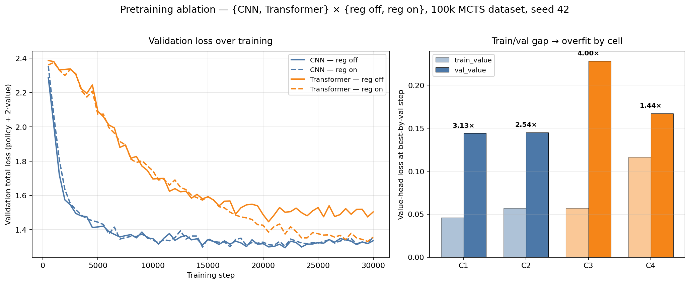
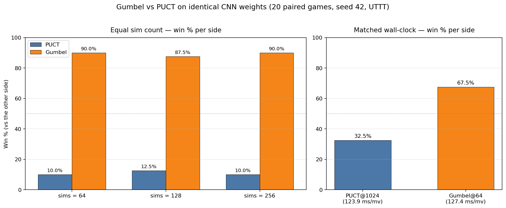
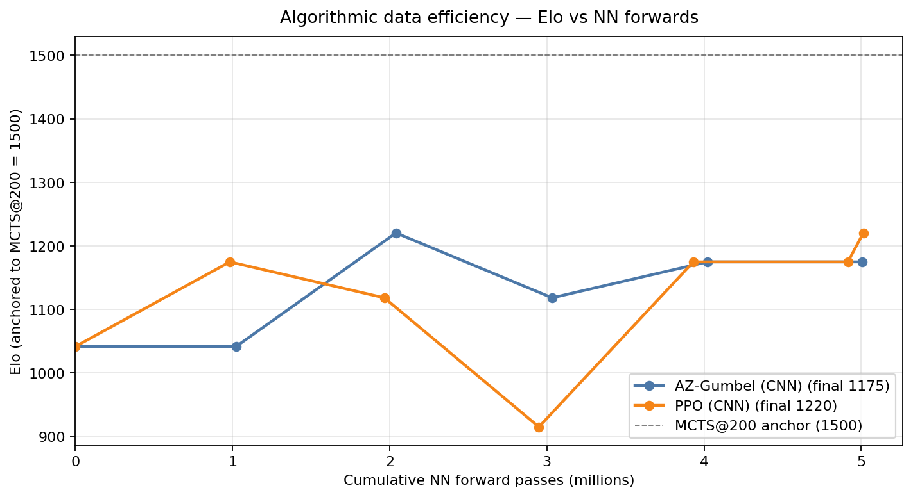

# AlphaToe

AlphaToe is a research project that trains and compares reinforcement-learning and search-based agents on **Ultimate Tic-Tac-Toe**. It implements a PPO baseline, pure MCTS, and customized AlphaZero-style pipelines (CNN vs Transformer for network architecture, and PUCT vs Gumbel for search algorithm) and pits them against each other in a head-to-head tournament.

## What it Does

AlphaToe is a project focuses on analyzing the performance of different RL algorithms in playing Ultimate Tic-Tac-Toe. It provides a fast vectorized PyTorch game environment (`src/env/`), interchangeable agents (`src/agents/{ppo, mcts, mcts_cuda, alphazero, alphagumbel}`), training entry points for each agent (`src/scripts/train_*.py`), a GPU-resident MCTS engine for the bootstrap dataset (`src/agents/mcts_cuda/`), and tournament tooling (`src/tournament/`) that benchmarks agents head-to-head and round-robin. A shared MCTS-bootstrap dataset and a controlled supervised-pretraining recipe (`src/scripts/pretrain_transformer.py`) are used to pre-train every neural agent on the same data, isolating architecture and training-loop effects from random exploration.

## Quick Start

Install (full instructions in `SETUP.md`):

```bash
uv sync
```
### Interactive Game Play
For interactive human-vs-AI play, an online version can be found [here](https://uttt.lzhang.dev).

You can also deploy a local version using the FastAPI web UI in `src/web/` serves a browser-based UTTT board against any AlphaZero checkpoint:

```bash
uv run uvicorn web.server:app --reload --app-dir src
# then open http://localhost:8000/
```

### Reproduce Experiment
The experimental pipeline runs in four stages. Each stage points to a writeup in `docs/` with the exact commands, hyperparameters, and tables.

1. **Generate the shared MCTS bootstrap dataset.** Produce the GPU-MCTS self-play data that every neural agent below pretrains on, so architecture and training-loop effects compare on the same data.
   ```bash
   uv run python data/generate_mcts_data.py --backend cuda --games 3000 --sims 100000 --out data/mcts_selfplay
   ```

   output: [`data/mcts_selfplay/dataset_100k.npz`](data/mcts_selfplay/) (full flag list in the script's module docstring).

2. **Supervised pretraining ablation.** Run the 2×2 ablation `{CNN, Transformer} × {regularized, not}` on the bootstrap dataset to isolate architecture and regularization effects before any RL. Four separate trainings — full per-cell commands in [`docs/PRETRAIN.md`](docs/PRETRAIN.md) section 8.
   
    outputs: pretrained checkpoints in [`models/cnn/`](models/cnn/) and [`models/transformer/`](models/transformer/); per-step training curves in [`runs/pretrain_cnn_100k{,_reg}/`](runs/) and [`runs/pretrain_transformer_100k{,_reg}/`](runs/).

3. **RL fine-tuning.** Warm-start from a stage-2 backbone (via `--checkpoint <path>`) and run three RL pipelines on the same starting weights: PPO baseline (`src/scripts/train_ppo.py`), AlphaZero-PUCT (`src/scripts/train_alphazero.py`, `src/scripts/train_transformer.py`), and AlphaGumbel (`src/scripts/train_alphagumbel.py`). Per-pipeline commands and hyperparameters in [`docs/GUMBEL_VS_PUCT.md`](docs/GUMBEL_VS_PUCT.md) and [`docs/PPO_VS_ALPHAGUMBEL.md`](docs/PPO_VS_ALPHAGUMBEL.md).\
  
    outputs: per-iteration checkpoints in `runs/<run-name>/iter_NNN_{accepted,rejected}.pt` (e.g. [`runs/az_cnn_gumbel/`](runs/), [`runs/ppo_warm_matched/`](runs/)).

4. **Tournament evaluation.** Run head-to-head matches between trained agents to attribute playing strength to specific design choices (search algorithm, training paradigm). Driven by `src/tournament/head_to_head.py`, `src/tournament/az_vs_az.py`, and `src/scripts/walltime_match.py`; full match recipes in [`docs/GUMBEL_VS_PUCT.md`](docs/GUMBEL_VS_PUCT.md) and [`docs/PPO_VS_ALPHAGUMBEL.md`](docs/PPO_VS_ALPHAGUMBEL.md).\
   
   outputs: per-match `summary.csv` and per-game CSVs under [`runs/tournament_sims{64,128,256}/`](runs/), [`runs/tournament_walltime_match{,_puct1024}/`](runs/), and [`runs/ppo_vs_gumbel/`](runs/).

## Video Links
The videos link can be found here:
- **Demo video**: [Google Drive](https://drive.google.com/file/d/1kvHOlDt9jxFEbwPIeznbXjEQyZKpdzL6/view?usp=drive_link)
- **Technical walkthrough**: [Google Drive](https://drive.google.com/file/d/1RSTpSqae2yF78_cxgyAKNf-7wkiv3eM0/view?usp=drive_link)

## Evaluation

Three experiments compare the agents along controlled axes. Each writeup in `docs/` contains the full methodology, per-row tables, and reproduction commands; only the headline conclusions are summarized here.

### 1. Comparing Network Architecture: Supervised pretraining ablation: [`docs/PRETRAIN.md`](docs/PRETRAIN.md)

A 2×2 factorial over `{CNN, Transformer} × {reg on, reg off}` on the bootstrap dataset, with capacity and schedule fixed by prior hyperparameter tuning (Appendix A in the writeup). **The CNN beats the Transformer cleanly when neither side is regularized (test_total 1.327 vs 1.508), but the gap collapses to 0.04 once both are fairly regularized.** Regularization is essentially a no-op on the CNN, since `AlphaZeroNet` already has BatchNorm in every residual block, leaving weight decay + value-head dropout with nothing to fix; on the Transformer it produces a ~10% test_total reduction (train/val value gap collapses from 3.99× to 1.44×). Policy loss bottoms out at ~2.00 across all four cells: a hard floor from MCTS visit-count label noise at this sims budget, not an architectural property.



### 2. Comparing Search Algorithms: Gumbel vs PUCT, same backbone: [`docs/GUMBEL_VS_PUCT.md`](docs/GUMBEL_VS_PUCT.md)

Both sides run on the same `cnn_c128b3_100k_reg_best.pt` weights; only the search algorithm differs. **Gumbel wins ~90% at equal sim counts across 64–256 sims, and still 67.5% in a wall-clock-matched match (Gumbel@64 vs PUCT@1024).** Gumbel costs ~12× more wall-time per sim, but PUCT does not recover that gap by spending the savings on more sims; it shows diminishing returns past ~768 sims, climbing only from 30.0% to 32.5% as the budget doubles from 768 to 1024. On this network and at this regime, Gumbel root selection + sequential halving extracts more useful information from the value head than PUCT's UCB exploration does.



### 3. Comparing Training Paradigm: PPO vs AlphaZero-Gumbel, shared pretrain: [`docs/PPO_VS_ALPHAGUMBEL.md`](docs/PPO_VS_ALPHAGUMBEL.md)

Both pipelines warm-start from the same regularized CNN pretrain, so any divergence is attributable to the post-pretraining stage. **They reach identical peak Elo (1220.4) and identical 16.7% win rate vs the shared MCTS@200 opponent, but in a direct 50-game head-to-head PPO wins 55–45** (n=50, inside the binomial CI, so suggestive rather than significant). The two recipes get there through different curves: AlphaZero-Gumbel is ~2.5× more sample-efficient (2.0 M vs 5.0 M NN forwards to peak), while PPO is ~22% faster wall-clock at training and ~57× cheaper per move at inference (1.63 ms vs 93.5 ms). Only 1/5 AlphaZero-Gumbel iterations passed the 0.45 acceptance gate; PPO has no equivalent guard and accepted all 150 updates. Most of the playing strength on this benchmark comes from the supervised pretrain; the RL stage adds a smaller delta in the budget we ran.



Cross-run plots and `convergence_summary.csv` live under `runs/comparison/` and `runs/comparison_mcts200/` (produced by `src/scripts/compare_runs.py`):

## Individual Contributions

This is an individual project.
