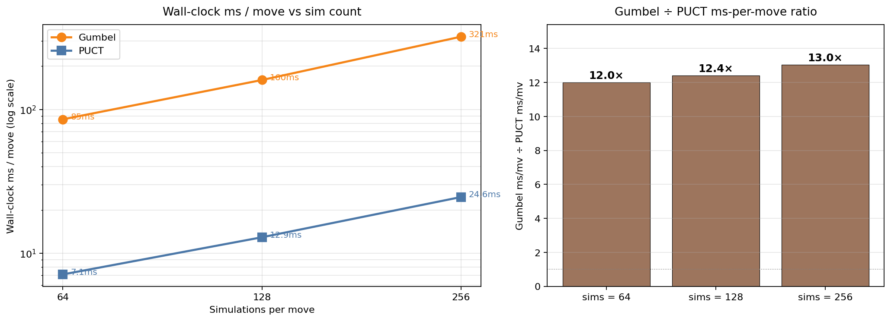
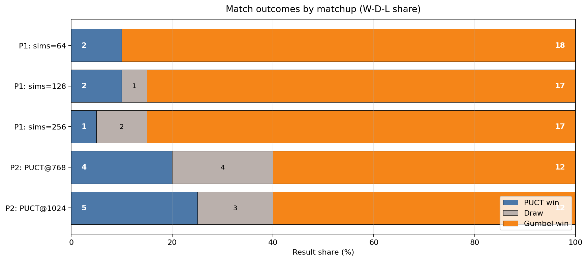
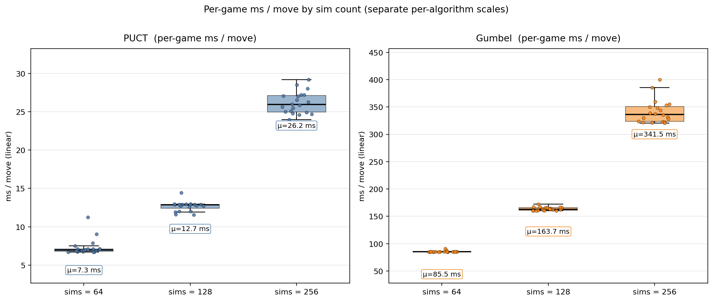

# Gumbel vs PUCT — Head-to-head with shared CNN backbone

This doc records what we learned from running head to head comparison between **Gumbel root selection** against **vanilla PUCT** when both algorithms run on **identical** network weights.

The setup isolates one variable: the search algorithm. Network, opening, deterministic move policy, and game count are matched across both sides.

| Component | Value |
|---|---|
| Backbone | `models/cnn/cnn_c128b3_100k_reg_best.pt` (regularized supervised pretrain on 100k MCTS dataset) |
| Channels / blocks | 128 / 3 |
| Search algos | `AlphaZeroMCTS` (PUCT) vs `AlphaGumbelMCTS` (Gumbel root + sequential halving, `max_root_actions=16`) |
| Move policy | Greedy (most-visited child, temperature 0) |
| Games per match | 20, paired openings (each opening played once from each side) |
| Seed | 42 |
| Hardware | NVIDIA RTX 4060 Laptop, CUDA |
| Tool | `src/tournament/head_to_head.py --agents az-selfplay gumbel-selfplay` |


*Hero figure: Phase 1 (equal sims) on the left, Phase 2 (matched wall-clock) on the right. Gumbel wins both regimes on the same network weights.*

## Phase 1 — Equal sims per move

Both sides receive the same simulation budget. The only difference is the selection rule (UCB-style PUCT vs Gumbel sampling + halving).

| Sims | PUCT W-D-L | Gumbel W-D-L | **Gumbel win%** | PUCT ms/mv | Gumbel ms/mv | Gumbel slowdown |
|---:|---:|---:|---:|---:|---:|---:|
| 64  | 2-0-18 | 18-0-2 | **90.0 %** |  7.12 |  85.36 | **12.0×** |
| 128 | 2-1-17 | 17-1-2 | **87.5 %** | 12.91 | 160.27 | **12.4×** |
| 256 | 1-2-17 | 17-2-1 | **90.0 %** | 24.59 | 320.79 | **13.0×** |

**Per-match raw logs:** `runs/tournament_sims{64,128,256}/summary.csv` plus per-game CSV.



*Both algorithms scale linearly in sims (left, log-log). Gumbel pays a constant ~12-13× per-sim overhead from Gumbel-noise sampling and sequential halving (right) — consistent across all three budgets.*



*Stacked win/draw/loss per match (PUCT in blue, draws grey, Gumbel in orange). Every Phase-1 match is a Gumbel landslide; Phase-2 cells visualize the narrower wall-clock-matched outcomes.*

### Findings

1. **Gumbel decisively outplays PUCT at equal sim count** — 87.5–90 % win rate at every budget tested. With identical weights this is purely an algorithmic gap.
2. **The win rate is flat across 64, 128, 256 sims.** Gumbel's edge isn't a low-sim phenomenon that closes as PUCT gets more search; it's a structural advantage that the network's policy/value heads play better into.
3. **Gumbel costs ~12× more wall-time per move** at all three budgets. The constant ratio is consistent with both algorithms scaling linearly in sim count, with Gumbel paying a fixed bookkeeping overhead (Gumbel noise sampling + sequential-halving subroutines) per sim that doesn't amortize away.



*Per-game ms/move distribution from raw `*_per_game.csv` data — boxes show the IQR, dots are individual games. Note the ~12× scale gap between the left (PUCT, ~7-26 ms) and right (Gumbel, ~85-342 ms) panels. Distributions are tight; the slowdown is consistent game-to-game, not driven by a few outliers.*

### Why Gumbel wins at low sims with this network

PUCT explores via UCB, which depends on accurate visit counts to balance exploration / exploitation. With only 64 sims, most root children get 0–4 visits and the UCB term dominates noisily. Gumbel's sequential halving instead concentrates compute on a sampled subset of root moves (`max_root_actions=16`) and progressively eliminates losers, so each remaining candidate gets ~4× more sims before the move is committed. On a network whose policy already concentrates probability on a handful of strong moves (which our pretrained CNN does), this is a much better use of a tiny sim budget.

## Phase 2 — Wall-clock-matched (Gumbel@64 vs PUCT@N)

The Phase 1 result is honest but not the whole story: in production you care about *time*, not raw sim count. To match wall-clock per move, PUCT can spend its 12× speed advantage on more sims.

`head_to_head.py` only takes a single global `--az-sims`, so the asymmetric-sims match requires a small custom driver (`src/scripts/walltime_match.py`) that loads the same checkpoint into two agents with different sim budgets and reuses the existing `run_match` infrastructure.

When two agents alternate on the same GPU within one Python process, their kernels queue against each other and the per-move walls don't exactly equal what each side would clock running alone. We ran two PUCT sim counts to bracket Gumbel's observed 127 ms/mv:

| Match | PUCT sims | PUCT ms/mv | Gumbel ms/mv | wall-clock matched? |
|---|---:|---:|---:|---|
| `tournament_walltime_match`         |  768 | 105.7 | 139.4 | undershoot (PUCT 24 % faster than Gumbel) |
| `tournament_walltime_match_puct1024`| 1024 | **123.9** | **127.4** | **within 3 %** |

The PUCT@1024 match is the cleanest wall-time comparison; the PUCT@768 match is included for completeness because it brackets the regime.

### Results

| Side | Sims | W | D | L | **Win%** | Pts |
|---|---:|---:|---:|---:|---:|---:|
| PUCT-Round 1|  768 |  4 | 4 | 12 | 30.0 % |  6.0 |
| Gumbel-Round 1|   64 | 12 | 4 |  4 | 70.0 % | 14.0 |
| PUCT-Round 2| 1024 |  5 | 3 | 12 | 32.5 % |  6.5 |
| Gumbel-Round 2|   64 | **12** | **3** | **5** | **67.5 %** | **13.5** |

Per-game CSVs: `runs/tournament_walltime_match*/puct{768,1024}_vs_gumbel64.csv`.


*Both Phase-2 matches side by side. Left: win % per match. Right: per-side ms/move shows the PUCT@1024 cell is the cleanest wall-clock match (3% gap), with PUCT@768 included as a bracket where PUCT was 24% faster.*

### Findings

1. **Gumbel still wins at matched wall time** — 67.5 % at PUCT@1024 (the properly-matched run) and 70 % at PUCT@768 (where PUCT was actually 24 % faster per move). The two PUCT sim counts give essentially the same outcome, which means the result is robust to small per-move-wall mismatches.
2. **The gap does close vs equal-sims.** Equal-sims gave Gumbel ~90 %, matched-walltime gives Gumbel ~67-70 %. PUCT recovered roughly 25 pp by trading per-sim cost for sim count.
3. **The remaining ~35 pp gap is the algorithmic edge.** It is not explained by Gumbel "cheating" with more compute per sim, because the wall-time match neutralises that. With this network and at this regime, Gumbel selection extracts more useful information from the value head than PUCT's UCB exploration does.
4. **PUCT diminishing returns past ~768 sims.** Doubling from 768 to 1024 only moved PUCT from 30 % to 32.5 % win rate — a 2.5 pp improvement for 33 % more compute. PUCT is approaching its ceiling on this network.

### What this means in practice

- For **inference** (eval / deployment): use Gumbel. Even at matched wall time it plays meaningfully stronger on this network.
- For **training-time self-play**: less obvious. Gumbel's selection diversity helps with low sims, but training data quality also depends on visit-count fidelity (the policy targets), which PUCT's UCB produces more cleanly. The training-time choice between PUCT and Gumbel is a separate experiment we did not run here.

## Notes

- **Single network checkpoint, single seed.** The 90 % rate is precise to within ±10 % at 20 games (95 % CI ≈ ±13 percentage points), so 87.5 → 90 → 90 should be read as "essentially identical" not as a trend. To resolve sub-5 % differences you'd need ~200 games per matchup.
- **Greedy play at temperature 0.** Both sides commit to their most-visited child every move. With temperature > 0 (training-time self-play noise), the gap could shrink — Gumbel's sample diversity matters less when both sides explore.
- **`max_root_actions=16`** is the default Gumbel knob. At very low sims (64), 16 root actions × 4 sims/action is the operational regime. At higher sims this knob matters less; at lower sims it would dominate.
- **CNN backbone, not Transformer.** The Transformer might give different results — its policy is less sharp than the CNN's, which could shift Gumbel's advantage.

## Reproduce

```bash
# Phase 1: equal-sims sweep (sims = 64, 128, 256)
for S in 64 128 256; do
  uv run python src/tournament/head_to_head.py \
    --agents az-selfplay gumbel-selfplay \
    --az-ckpt models/cnn/cnn_c128b3_100k_reg_best.pt \
    --az-sims $S --games 20 --leaf-batch 64 --seed 42 \
    --log-dir runs/tournament_sims$S
done

# Phase 2: wall-clock-matched matches
uv run python src/scripts/walltime_match.py \
  --ckpt models/cnn/cnn_c128b3_100k_reg_best.pt \
  --puct-sims 768 --gumbel-sims 64 \
  --leaf-batch 64 --games 20 --seed 42 \
  --out-dir runs/tournament_walltime_match

uv run python src/scripts/walltime_match.py \
  --ckpt models/cnn/cnn_c128b3_100k_reg_best.pt \
  --puct-sims 1024 --gumbel-sims 64 \
  --leaf-batch 64 --games 20 --seed 42 \
  --out-dir runs/tournament_walltime_match_puct1024
```