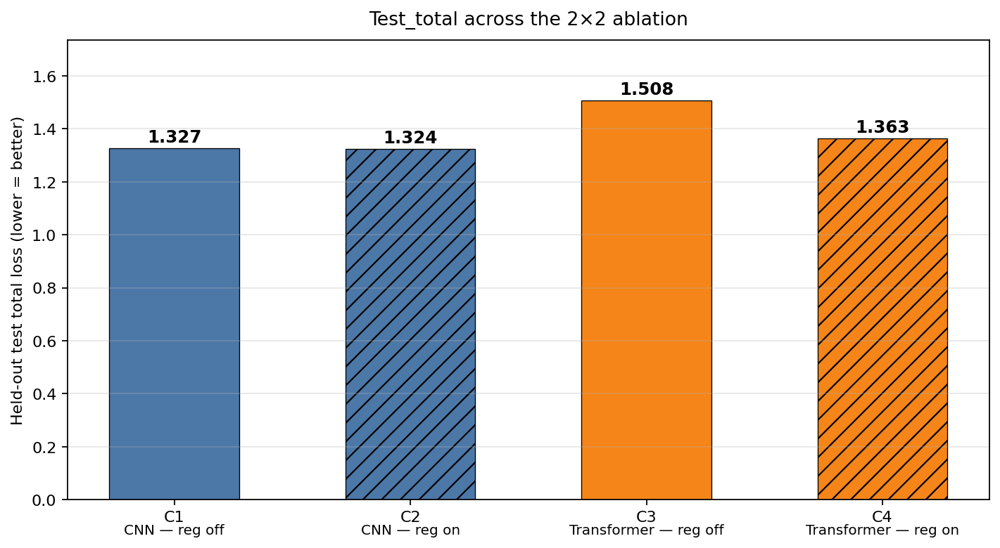
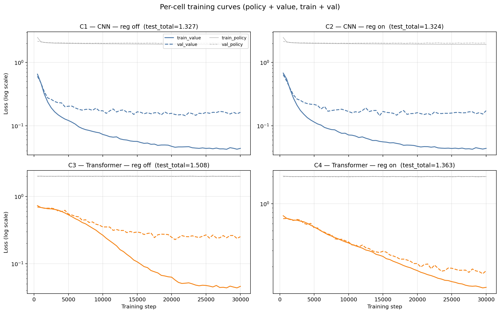
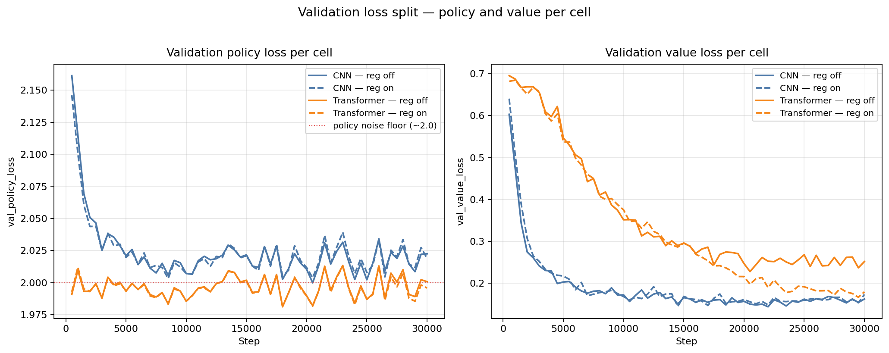
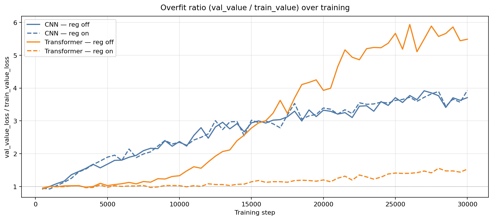
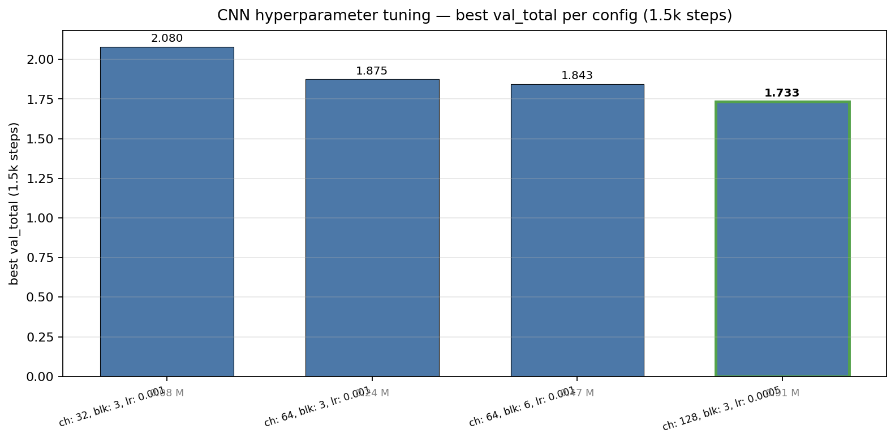
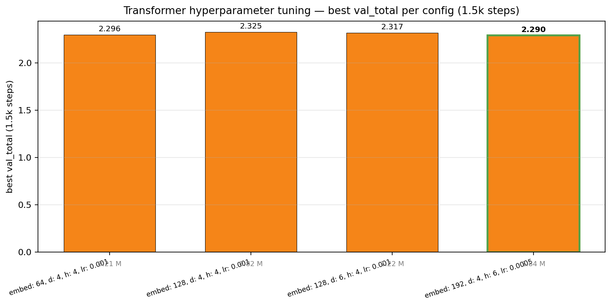

# UTTT Network Pretraining

This document presents the structure design and hyperparameter selection under a controlled ablation study on supervised pretraining of policy-value backbones for Ultimate Tic-Tac-Toe.

## 1. Research Questions

1. **Architecture (RQ1).** Does the choice of backbone (CNN vs Transformer) change pretraining quality on this dataset, holding capacity, optimizer schedule, and data fixed?
2. **Regularization (RQ2).** Does explicit regularization (weight decay + value-head dropout) materially change generalization?
3. **Interaction (RQ3).** Does the answer to RQ2 depend on the architecture?

## 2. Ablation Design

Two independent design axes are crossed in a 2×2 factorial:

**A: Architecture of Policy Value Network**
- CNN (`AlphaZeroNet`)
- Transformer (`AlphaZeroTransformerNet`)

**B: Regularization**
- Off (Adam, no dropout)
- On (AdamW `weight_decay=1e-4` + `value_dropout=0.3`; transformer additionally uses block `dropout=0.1`)

This yields four conditions:

| ID | Architecture | Regularization |
|---|---|---|
| C1 | CNN | Off |
| C2 | CNN | On |
| C3 | Transformer | Off |
| C4 | Transformer | On |

The model architecture is fixed at the best configuration (see [Appendix A](#appendix-a--base-configuration-selection-hyperparameter-tuning)) so the ablation is not confounded by under-tuned baselines.

## 3. Controlled Variables (constant across all four conditions)

### 3.1 Dataset 
 - **Dataset Format**: `data/mcts_selfplay/dataset_100k.npz` — 152,760 sample-level positions, each a `(6, 9, 9) float32` observation, `(9, 9) float32` MCTS visit-count policy target, scalar value target in `[-1, 1]`.
 - **Train/Test Split**: Single shuffle with `--seed 42`, partitioned **80% train / 10% val / 10% test** at the position level. The test split is held out and evaluated *once per run** as the unbiased final score; all model selection is done on val. The same seed is reused across all conditions so val/test scores are directly comparable.
### 3.2 Training Settings 
- **Loss**: `0.5 * cross_entropy(policy) + 2.0 * MSE(value)` (matches `agents/alphazero/ransformer_trainer.train_step`).
* **Schedule**: 30,000 steps, batch 256, cosine LR `5e-4 → 5e-5`, val every 500 steps, 20 val minibatches per eval. Best-by-val checkpoint saved separately from the final-step checkpoint.
* **Structure**: CNN: `channels=128, num_blocks=3` (≈912 k params). Transformer: `embed_dim=192, depth=4, num_heads=6` (≈1.83 M params). Selected by the hyperparameter tuning reported in Appendix A.

## 4. Results

### 4.1 Headline 4-cell table

| ID | Run | Best step | train_value | val_value | Gap | val_total | **test_total** |
|---|---|---:|---:|---:|---:|---:|---:|
| C1 | CNN — reg off | 22,000 | 0.046 | 0.144 | 3.10× | 1.295 | **1.327** |
| C2 | CNN — reg on  | 14,500 | 0.057 | 0.145 | 2.55× | 1.299 | **1.324** |
| C3 | TX  — reg off | 20,500 | 0.057 | 0.228 | 3.99× | 1.447 | **1.508** |
| C4 | TX  — reg on  | 29,500 | 0.116 | 0.167 | **1.44×** | 1.332 | **1.363** |

`Gap` = val_value / train_value (overfit ratio on the value head).\
`*_total` = combined policy+value loss as defined in §3.


*Two panels: (left) validation total loss over 30k training steps for all four cells; (right) train vs val value-head loss at the best-by-val step, with overfit ratio annotated above each pair. C3 (TX, reg off) shows the largest gap (~4×); C4 (TX, reg on) the smallest (~1.4×).*



*Held-out test_total per cell. The CNN cells are nearly tied; the Transformer-reg-off bar (C3) stands out as the only cell with a clearly worse test_total.*

### 4.2 Train/val gap on the value head (axis A × axis B)

| | Reg off | Reg on |
|---|---:|---:|
| **CNN** | 3.10× | 2.55× |
| **Transformer** | 3.99× | **1.44×** |

## 5. Analysis

### 5.1 Main effect of Architecture

Holding regularization fixed, the CNN beats the Transformer on test_total in both the unregularized and regularized columns:

| | Reg off | Reg on |
|---|---:|---:|
| CNN test_total | 1.327 | 1.324 |
| TX  test_total | 1.508 | 1.363 |
| Δ (CNN − TX)   | −0.181 | **−0.039** |

The CNN advantage is significant when no regularization is imposed but shrinks by 1/5 once both architectures are fairly regularized.

Thus, most of the advantages for CNN over the transformer come from the unregularized comparison was the transformer's uncorrected overfit, not an inherent architectural advantage on this task.



*Per-cell train and val curves (log-scale loss). Solid lines are training, dashed are val; thick lines are value loss, thin grey lines are policy loss. The C3 panel (TX, reg off) shows the dramatic value-head overfit; the C4 panel (TX, reg on) is the only cell where train and val track each other closely.*

### 5.2 Main effect of Regularization

Holding architecture fixed:

| | Test_total Δ (reg on − reg off) |
|---|---:|
| CNN | −0.003  (within noise) |
| Transformer | **−0.145  (≈10% of baseline)** |

Regularization has essentially **no effect on the CNN** and a **clear effect on the Transformer**. This is an interaction effect, not a clean main effect.



*Why the cells differ: val_policy_loss (left) sits at the ~2.0 noise floor for every cell — the dataset bounds policy loss regardless of architecture or regularization. val_value_loss (right) is what actually separates the cells, with the C3/C4 transformer pair showing the regularization swing.*

### 5.3 Interaction effect

The dominant finding is the **Architecture × Regularization interaction**:

**CNN**: Test_total moved 1.327 → 1.324 (within noise). The train/val gap closed slightly (3.10× → 2.55×) but val_value barely moved (0.144 → 0.145). **Why:** `AlphaZeroNet` already has BatchNorm in every residual block, which is a strong implicit regularizer, so weight decay + dropout had little extra to give. The CNN was already at the data-bound floor for value loss.

**Transformer**: Test_total dropped 1.508 → 1.363 (≈10%). The train/val value gap collapsed from 3.99× to **1.44×**. val_value fell 0.228 → 0.167 (27% reduction).

**Potential Explanation:** `AlphaZeroTransformerNet` has no BatchNorm and our prior runs used `dropout=0.0` everywhere. This leads to overfitting and is solved by adding regularization. The regularized run also kept improving longer (best step 29,500 vs 20,500).

**Policy loss is invariant across all four cells**: (~2.00–2.03). Predicted: no regularizer can move the noise floor of MCTS visit-count labels at this sims budget. This is the dataset's intrinsic policy noise, not a property of any model.



*val_value_loss / train_value_loss over training. C3 (TX, reg off) diverges sharply as training proceeds; C4 (TX, reg on) is the only Transformer trace that holds the gap close to 1×. Both CNN cells (solid + dashed blue) drift gently above 2× regardless of regularization.*

## 6. Limitations

* **Policy loss ≈ 2.00 is a hard floor** — pure label noise from MCTS visit counts at this sims budget. More compute on the same dataset will not push this lower for any architecture or regularization recipe.
* **Best-by-val plateaus around step 20–30 k** at the chosen schedule. More steps drift val upward without producing a better checkpoint.
* **Value-head overfit (transformer) is gone after regularization.** Any further headroom requires **more or better data** — e.g., 8× symmetry augmentation via UTTT's D4 group, or a larger MCTS-self-play dataset — not more model capacity along axis A.
* **Single-seed runs.** Each of the four cells is one run with `seed=42`. Effect sizes >0.05 in test_total are robust given the train/val gap patterns, but the C1 vs C2 wash should not be over-interpreted.

## 7. Conclusions

1. **RQ1 (architecture):** CNN > Transformer on this dataset, but the gap is small (Δtest_total = 0.04) once both are fairly regularized.
2. **RQ2 (regularization):** No universal answer — the effect size is architecture-dependent.
3. **RQ3 (interaction):** Yes, strong interaction. Regularization helps the Transformer (≈10% test_total reduction) and is a no-op for the CNN, because BatchNorm already plays the regularizer role for the CNN.

## 8. Recommendations:

* Use the regularized recipe by default for both architectures. It doesn't hurt the CNN and substantially helps the Transformer.
* Treat the policy loss as data-bound at this sims budget; focus on value loss instead.
* Focus on invest in data (Data augmentation, larger MCTS dataset) before model capacity.

## 8. Reproduce

```bash
# Phase 1 — hyperparameter tuning (selects the per-arch base config used in the ablation)
uv run python src/scripts/tune_pretrain.py \
    --dataset data/mcts_selfplay/dataset_100k.npz \
    --steps-per-trial 1500 --eval-every 150 --val-batches 10 \
    --run-dir runs/tune_100k --seed 42

# C1 — CNN, reg off
uv run python src/scripts/pretrain_transformer.py --arch cnn \
    --dataset data/mcts_selfplay/dataset_100k.npz \
    --channels 128 --num-blocks 3 \
    --lr 5e-4 --lr-min 5e-5 --steps 30000 \
    --batch-size 256 --eval-every 500 --val-batches 20 \
    --run-dir runs/pretrain_cnn_100k \
    --out models/cnn/cnn_c128b3_100k.pt --seed 42

# C3 — Transformer, reg off
uv run python src/scripts/pretrain_transformer.py --arch transformer \
    --dataset data/mcts_selfplay/dataset_100k.npz \
    --embed-dim 192 --depth 4 --num-heads 6 \
    --lr 5e-4 --lr-min 5e-5 --steps 30000 \
    --batch-size 256 --eval-every 500 --val-batches 20 \
    --run-dir runs/pretrain_transformer_100k \
    --out models/transformer/tx_e192d4h6_100k.pt --seed 42

# C2 — CNN, reg on
uv run python src/scripts/pretrain_transformer.py --arch cnn \
    --dataset data/mcts_selfplay/dataset_100k.npz \
    --channels 128 --num-blocks 3 \
    --value-dropout 0.3 --weight-decay 1e-4 \
    --lr 5e-4 --lr-min 5e-5 --steps 30000 \
    --batch-size 256 --eval-every 500 --val-batches 20 \
    --run-dir runs/pretrain_cnn_100k_reg \
    --out models/cnn/cnn_c128b3_100k_reg.pt --seed 42

# C4 — Transformer, reg on
uv run python src/scripts/pretrain_transformer.py --arch transformer \
    --dataset data/mcts_selfplay/dataset_100k.npz \
    --embed-dim 192 --depth 4 --num-heads 6 \
    --dropout 0.1 --value-dropout 0.3 --weight-decay 1e-4 \
    --lr 5e-4 --lr-min 5e-5 --steps 30000 \
    --batch-size 256 --eval-every 500 --val-batches 20 \
    --run-dir runs/pretrain_transformer_100k_reg \
    --out models/transformer/tx_e192d4h6_100k_reg.pt --seed 42
```

## 9. Checkpoint map

| File | Cell | What it is | When to use |
|---|---|---|---|
| `models/cnn/cnn_c128b3_100k_best.pt` | C1 | Best-by-val CNN, reg off | Reference baseline |
| `models/cnn/cnn_c128b3_100k_final.pt` | C1 | Final-step CNN, reg off | Mostly redundant with `_best` |
| `models/cnn/cnn_c128b3_100k_reg_best.pt` | C2 | Best-by-val CNN, reg on | **Practical pick — same perf, slightly tighter gap** |
| `models/cnn/cnn_c128b3_100k_reg.pt` | C2 | Final-step CNN, reg on | — |
| `models/transformer/tx_e192d4h6_100k_best.pt` | C3 | Best-by-val TX, reg off | Pre-regularization baseline |
| `models/transformer/tx_e192d4h6_100k_final.pt` | C3 | Final-step TX, reg off | — |
| `models/transformer/tx_e192d4h6_100k_reg_best.pt` | C4 | Best-by-val TX, reg on | **Recommended transformer checkpoint** |
| `models/transformer/tx_e192d4h6_100k_reg.pt` | C4 | Final-step TX, reg on | — |

All checkpoints store `model_type`, `model_config`, and a `pretrain` block with the dataset path, split sizes, and final test losses, so `train_alphazero.py --checkpoint <path>` and `train_transformer.py --checkpoint <path>` can resume them directly.

---

## Appendix A — Base configuration selection (Hyperparameter Tuning)

The capacity used for each architecture in the ablation above (CNN `channels=128, blocks=3`; TX `embed_dim=192, depth=4, num_heads=6`) was selected via a short hyperparameter tuning run so the ablation is not confounded by an under-tuned baseline. The tuning run itself is **not** part of the ablation, since it varies hyperparameter values, not design choices, but the results are recorded here for completeness.

A 1500-step hyperparameter tuning run over 4 configs per arch on the same train/val/test split, ranked by `best_val_total` seen during training. Per-trial training curves live under `runs/tune_100k/<arch>_tNN/`; aggregate results in `runs/tune_100k/sweep_results.csv`.

### CNN grid

| Config | Params | best val_total | test_total |
|---|---:|---:|---:|
| `channels=32, blocks=3, lr=1e-3` | 76,090 | 2.080 | 2.109 |
| `channels=64, blocks=3, lr=1e-3` (default) | 244,250 | 1.875 | 1.881 |
| `channels=64, blocks=6, lr=1e-3` | 466,202 | 1.843 | 1.818 |
| **`channels=128, blocks=3, lr=5e-4`** | **912,346** | **1.733** | **1.755** |

Bigger + lower LR wins. The best config's val curve was still falling fast at step 1500 (2.05 → 1.97 → 1.88 → 1.79 → 1.73), so it has potential to improve for a longer run.



*CNN hyperparameter tuning. Bars are sorted by parameter count (annotated below each bar); the green-outlined bar is the chosen config (`channels=128, blocks=3, lr=5e-4`). Strict monotonic improvement with capacity, and the lower learning rate of the largest config gives the cleanest result.*

### Transformer grid

| Config | Params | best val_total | test_total |
|---|---:|---:|---:|
| `embed=64, d=4, h=4, lr=1e-3` | 210,306 | 2.296 | 2.316 |
| `embed=128, d=4, h=4, lr=1e-3` (default) | 822,018 | 2.325 | 2.331 |
| `embed=128, d=6, h=4, lr=1e-3` | 1,218,562 | 2.317 | 2.327 |
| **`embed=192, d=4, h=6, lr=5e-4`** | **1,835,138** | **2.290** | **2.314** |

All four configs land within **0.04 val_total of each other**. The transformer is not size-bound at this dataset. The lower LR (5e-4) is slightly better, but the curves were nearly flat at lr=1e-3. This shows that optimization was the bottleneck, regardless of the model capacity.



*Transformer hyperparameter tuning. Bars are nearly flat across capacity (210k → 1.84M params) — only ~0.04 val_total spread. The chosen `embed=192, d=4, h=6, lr=5e-4` config is marginally best; the win comes from the lower LR, not from added capacity.*
